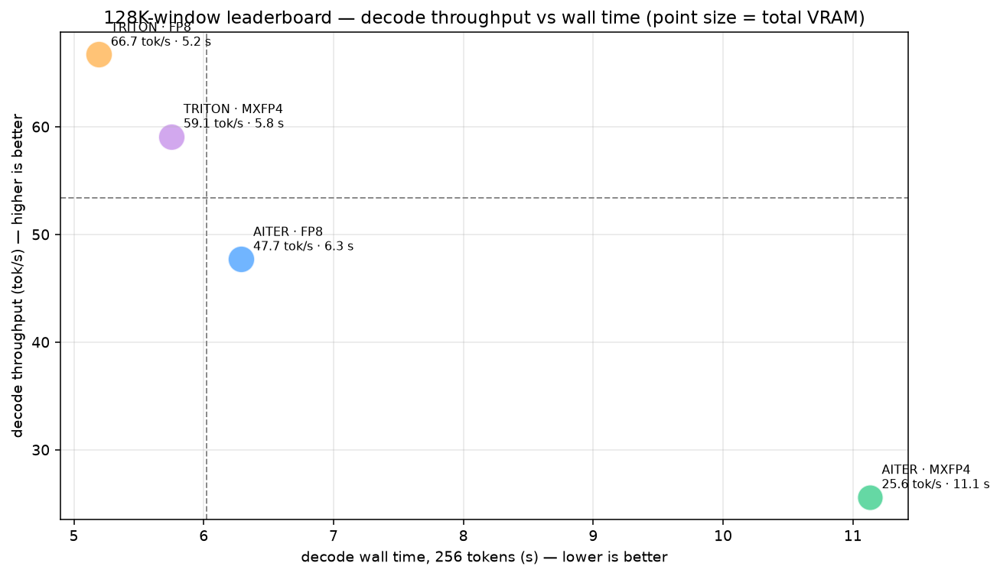
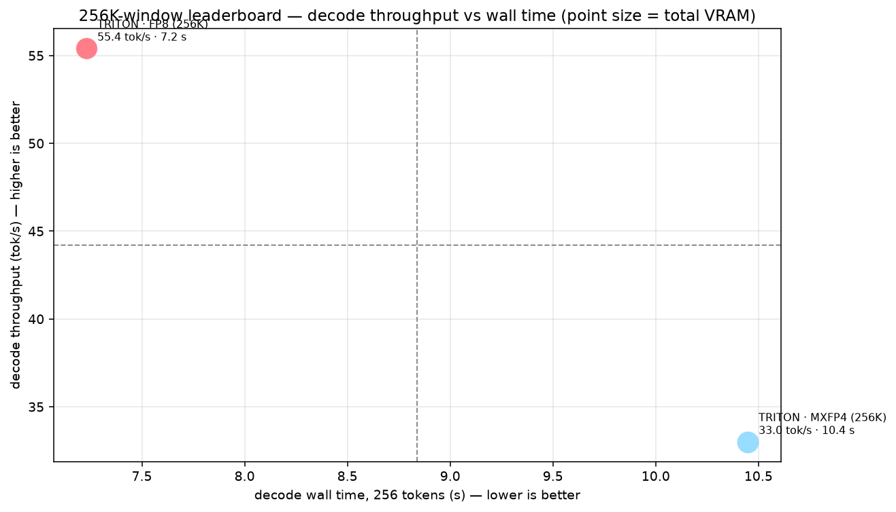
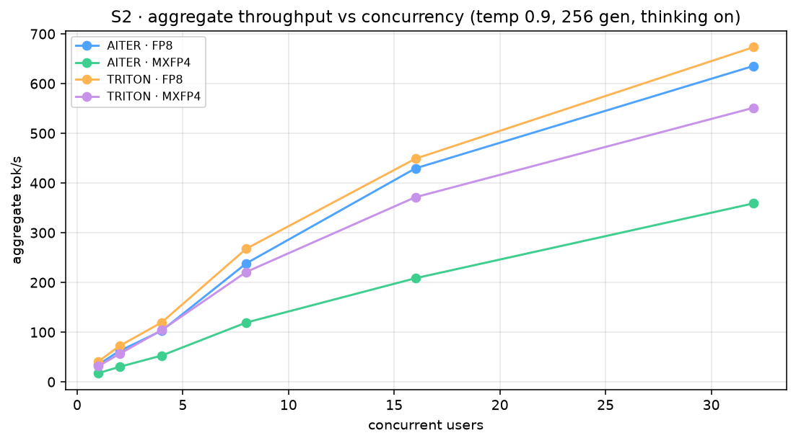
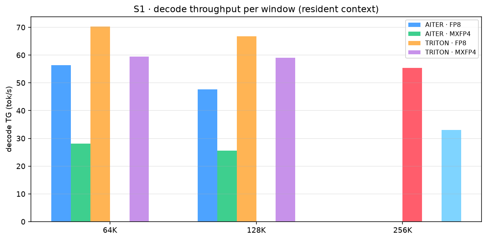

# Dual AMD R9700 — `Qwen3.8-27B` Serving Benchmark

**Measuring how `Qwen3.8-27B` runs at the extremes on a 2× AMD Radeon AI PRO R9700 (gfx1201 / RDNA 3.5)
box: vLLM attention backends (AITER vs the RDNA4 port's `TRITON_ATTN`) × quantization (FP8 vs
MXFP4), across a 64K / 128K / 256K window, 1→32-user concurrency, and a harness-agent coding task.**

> The full write-up with every table, raw data, and all charts is in
> [`benchmark-campaign/report/REPORT.md`](benchmark-campaign/report/REPORT.md). This README is the
> results summary.

---

## TL;DR — the verdict

**Best all-round setup: vLLM RDNA4 port with `TRITON_ATTN` on the FP8 checkpoint.**

- **TRITON beats AITER by +25–40% on long-context decode** (70 vs 56 t/s at 64K; 67 vs 48 t/s at 128K).
- **FP8 beats MXFP4 by +11–15% on decode** — MXFP4's value is memory/context density, not speed.
- **AITER is capped at 128K context** — only TRITON serves the native 262K window.
- **AITER *can* load MXFP4**, but through a slow Triton dequant fallback (**~2.6× slower** than AITER+FP8).

> *Pick by workload:* burst short-query concurrency → TRITON·FP8 · max context (256K) → TRITON ·
> single-stream long-context decode → TRITON·FP8.

---

## The graphs

**128K leaderboard** — decode throughput vs wall time (point size = total VRAM; top-left = best)

**256K leaderboard**

**Concurrency** — aggregate throughput vs users (temp 0.9, 256 gen)

**Harness-agent task** — wall time & output tokens (build a 3D zombie game, ~200 LOC)

**Decode throughput per window** (resident context)

All nine charts: [`benchmark-campaign/report/graphs/`](benchmark-campaign/report/graphs/) —
prefill PP vs window (g1), decode TG (g2), cold TTFT (g3), concurrency (g4), agent (g5), scoreboard
(g6), leaderboards (g7/g8), and an agent-token pie (g9).

---

## Results

**Single-user decode** (thinking off, temp 0, best run per window):

| setup | 64K | 128K | 256K |
|---|---|---|---|
| **TRITON · FP8** | **70.3 t/s** | **66.7 t/s** | **55.4 t/s** |
| TRITON · MXFP4 | 59.5 t/s | 59.1 t/s | 33.0 t/s |
| AITER · FP8 | 56.3 t/s | 47.7 t/s | n/a (128K cap) |
| AITER · MXFP4 | 28.1 t/s | 25.6 t/s | n/a (128K cap) |

**Concurrency (c32 aggregate, temp 0.9, 256 gen):** TRITON·FP8 **673 t/s** · AITER·FP8 636 t/s ·
TRITON·MXFP4 551 t/s · AITER·MXFP4 359 t/s.

**Harness-agent task:** all four wrote a runnable file. **TRITON·FP8 fastest (348 s, 212 lines)**;
AITER·MXFP4 slowest (28 t/s, 254 lines). Prefill PP spans ~1.3–2.5 k t/s and TTFT at 128K is ~60–90 s
(details in the report).

---

## What was tested

| setup | backend | model | port |
|---|---|---|---|
| TRITON · FP8 | vLLM RDNA4 port, `TRITON_ATTN` | `Qwen/Qwen3.8-27B-FP8` | 8012 |
| TRITON · MXFP4 | vLLM RDNA4 port, `TRITON_ATTN` | `Qwen3.8-27B-MXFP4-Quark-RDNA4` | 8013 |
| AITER · FP8 | vLLM AITER, `ROCM_AITER_UNIFIED_ATTN` | `Qwen/Qwen3.8-27B-FP8` | 8010 |
| AITER · MXFP4 | vLLM AITER, `ROCM_AITER_UNIFIED_ATTN` | `Qwen3.8-27B-MXFP4-Quark-RDNA4` | 8011 |

Served on **2× R9700, tensor-parallel 2**, identical vLLM flags (gpu-mem-util 0.95, max-num-seqs 32,
fp8 KV, prefix caching, MTP-3); only the backend, image, model, and NCCL env differ (hard
dependencies). Scenarios: single-user prefill/decode at 64K/128K/256K, 1→32-user concurrency
(temp 0.9), and a harness-agent "build a 3D zombie shooting game (~200 LOC)" task.

---

## Hardware & method

2× AMD Radeon AI PRO R9700 (gfx1201, 32 GiB each, no xGMI — TP2 over PCIe 5.0 x16) · Ryzen 9 9950X ·
125 GiB DDR5 · CachyOS · ROCm 7.2.4 · Podman 6.1.0. Token counts come from the server `usage`
(never SSE chunks); results are apples-to-apples across setups (same flags, same inputs).

> Reproduce the suite with `benchmark-campaign/run_setup.py ...` (see
> [`benchmark-campaign/README.md`](benchmark-campaign/README.md)); raw data per setup is in
> [`benchmark-campaign/data/`](benchmark-campaign/data/) (plus the agent-written game files in
> `data/<setup>/agent_games/`).

---

## Attribution & licensing

- **vLLM** — [vllm-project/vllm](https://github.com/vllm-project/vllm), Apache-2.0.
- **RDNA4 port** — [Capicua25x/vllm-rocm-rdna4](https://github.com/Capicua25x/vllm-rocm-rdna4),
  Apache-2.0 (gfx1201 enablement & MXFP4 kernels; credit chain in its `RDNA4-PORT.md`:
  tcclaviger/Rob Smith, Capicua25x, andysalerno/prcoe1).
- **Models** — `Qwen/Qwen3.8-27B-FP8` and `Qwen3.8-27B-MXFP4-Quark-RDNA4` (Apache-2.0);
  MXFP4 quantization via AMD Quark.
- **Measurements** are the author's own, recorded from the runs in `data/`; AI assistance was used
  to write the benchmark runners and this report — no benchmark value was generated by a model.
