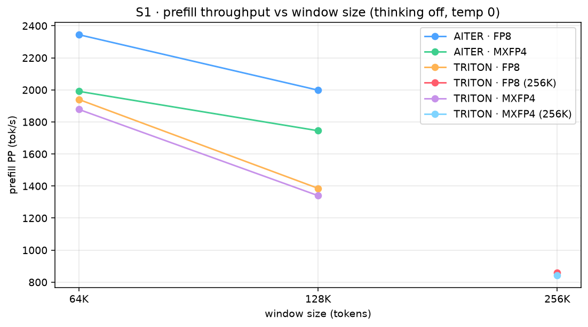
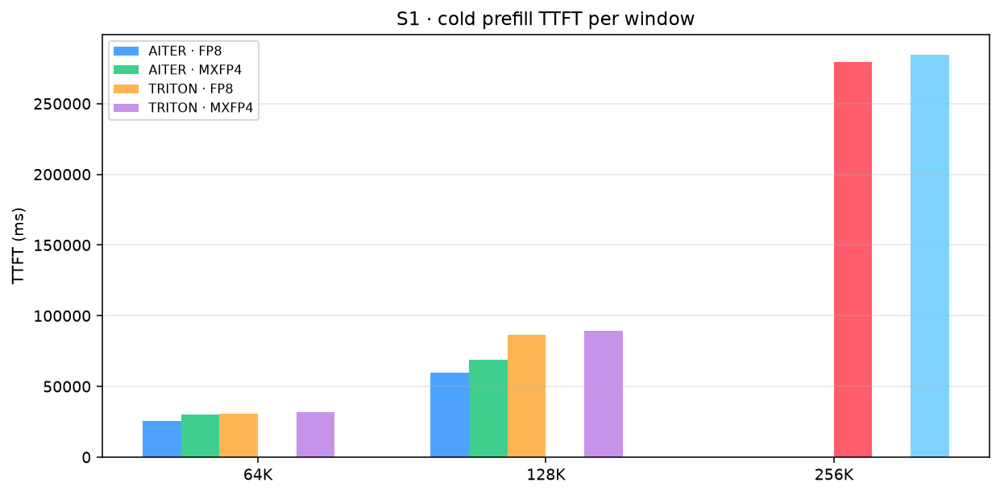
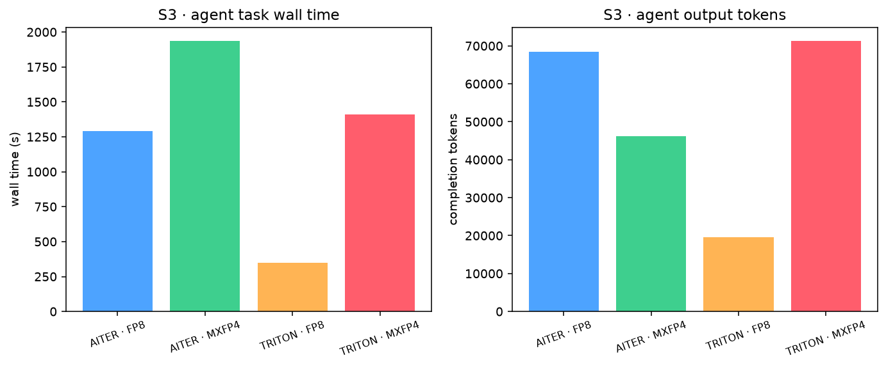

# Qwen3.8-27B on dual R9700 — vLLM AITER vs TRITON, FP8 vs MXFP4: benchmark report

**Date:** 2026-08-30  ·  **Hardware:** 2× AMD Radeon AI PRO R9700 (gfx1201, RDNA 3.5, 32 GiB each, no xGMI), Ryzen 9 9950X, CachyOS, ROCm 7.2.4 · **Model:** Qwen3.8-27B (FP8 stock & MXFP4 Quark RDNA4)

## 1. Setups under test (apples-to-apples)

| id | backend | model | port | max-model-len |
|---|---|---|---|---|
| `aiter-fp8` | AITER · FP8 | bench-aiter-fp8 | 8010 | 131072 |
| `aiter-mxfp4` | AITER · MXFP4 | bench-aiter-mxfp4 | 8011 | 131072 |
| `triton-fp8` | TRITON · FP8 | bench-triton-fp8 | 8012 | 131072 |
| `triton-mxfp4` | TRITON · MXFP4 | bench-triton-mxfp4 | 8013 | 131072 |
| `triton-fp8-262k` | TRITON · FP8 (256K) | bench-triton-fp8-262k | 8014 | 262144 |
| `triton-mxfp4-262k` | TRITON · MXFP4 (256K) | bench-triton-mxfp4-262k | 8015 | 262144 |

All flags identical except hard dependencies (attention backend, image, model path, NCCL env): TP2, gpu-memory-utilization 0.95, max-num-seqs 32, max-num-batched-tokens 8192, kv-cache-dtype fp8, mamba-ssm-cache-dtype bfloat16, prefix caching, qwen3_xml tool parser, MTP-3 speculative decoding. AITER cannot exceed 131072 context, so 256K-window rows exist only for the two TRITON `-262k` setups.

## 2. Methodology

- **S1 single-user:** chat completions, streaming, thinking **off**, temp 0, concurrency 1, tokens from server `usage`. prefill = W−64 → 1 token (PP = prompt/TTFT); decode = W−64 → 256 tokens (TG = 1/mean TPOT). Decode runs reuse the warm prefix, so decode TTFT reflects resident context (consistent across setups).
- **S2 concurrency:** 1→32 users, temp 0.9, top_p 0.95, 256 gen, thinking **on**, non-streaming, usage-counted, distinct essay prompts.
- **S3 harness agent:** minimal agent harness (system prompt + `write_file`/`finish_task` tools, ≤12 rounds, temp 0.7, thinking on) per setup, task: *"build a 3D zombie shooting game with 200 lines of code"*.

## 3. S1 — prefill & decode at 64K / 128K / 256K windows

### Leaderboard (lower wall time + higher throughput = better; point size = total VRAM)

### Prefill / decode vs window

| setup | window | PP (t/s) | cold TTFT (ms) | TG (t/s) | warm TTFT (ms) | e2e (t/s) |
|---|---|---|---|---|---|---|
| AITER · FP8 | 64K | 2,345 | 25,556 | 56.3 | 560 | 50.3 |
| AITER · FP8 | 128K | 1,999 | 59,978 | 47.7 | 947 | 40.7 |
| AITER · FP8 | 256K | — | — | — | — | — |
| AITER · MXFP4 | 64K | 1,991 | 30,094 | 28.1 | 722 | 26.2 |
| AITER · MXFP4 | 128K | 1,745 | 68,681 | 25.6 | 1,139 | 23.0 |
| AITER · MXFP4 | 256K | — | — | — | — | — |
| TRITON · FP8 | 64K | 1,940 | 30,881 | 70.3 | 750 | 58.5 |
| TRITON · FP8 | 128K | 1,386 | 86,486 | 66.7 | 1,366 | 49.3 |
| TRITON · FP8 | 256K | — | — | — | — | — |
| TRITON · MXFP4 | 64K | 1,878 | 31,899 | 59.5 | 831 | 50.0 |
| TRITON · MXFP4 | 128K | 1,340 | 89,427 | 59.1 | 1,440 | 44.5 |
| TRITON · MXFP4 | 256K | — | — | — | — | — |
| TRITON · FP8 (256K) | 64K | — | — | — | — | — |
| TRITON · FP8 (256K) | 128K | — | — | — | — | — |
| TRITON · FP8 (256K) | 256K | 858 | 279,419 | 55.4 | 2,625 | 35.4 |
| TRITON · MXFP4 (256K) | 64K | — | — | — | — | — |
| TRITON · MXFP4 (256K) | 128K | — | — | — | — | — |
| TRITON · MXFP4 (256K) | 256K | 842 | 284,649 | 33.0 | 2,712 | 24.5 |

## 4. S2 — concurrency (temp 0.9, 256 gen, thinking on)

| setup | c1 per-user | c4 agg | c8 agg | c16 agg | c32 agg | c32 per-user |
|---|---|---|---|---|---|---|
| AITER · FP8 | 34.9 | 103.0 | 238.4 | 429.5 | 635.5 | 22.3 |
| AITER · MXFP4 | 17.5 | 53.0 | 119.4 | 208.5 | 359.1 | 12.0 |
| TRITON · FP8 | 41.0 | 119.7 | 267.9 | 448.9 | 673.3 | 22.4 |
| TRITON · MXFP4 | 31.6 | 104.3 | 221.2 | 371.5 | 551.4 | 18.6 |
| TRITON · FP8 (256K) | — | — | — | — | — | — |
| TRITON · MXFP4 (256K) | — | — | — | — | — | — |

## 5. S3 — harness agent: build a 3D zombie shooting game (~200 LOC)

| setup | rounds | tool calls | files | total LOC | complete | wall (s) | out tokens | eff tok/s |
|---|---|---|---|---|---|---|---|---|
| AITER · FP8 | 11 | 5 | 1 | 180 | True | 1,288.9 | 68387 | 75.0 |
| AITER · MXFP4 | 7 | 3 | 1 | 254 | True | 1,936.5 | 46264 | 28.4 |
| TRITON · FP8 | 4 | 2 | 1 | 212 | True | 347.5 | 19497 | 71.4 |
| TRITON · MXFP4 | 11 | 4 | 1 | 182 | True | 1,408.6 | 71306 | 61.3 |
| TRITON · FP8 (256K) | — | — | — | — | — | — | — | — |
| TRITON · MXFP4 (256K) | — | — | — | — | — | — | — | — |

Agent transcripts (files the model wrote) are in `data/<setup>/agent_games/`.

## 6. Findings

- **AITER context ceiling:** `aiter-fp8` is capped at max-model-len 131072 (131072) — 256K-window rows exist only for the TRITON `-262k` setups. On this 2×R9700 box, AITER cannot address the native 262K window.
- **Prefill @ 64K:** fastest prefill is AITER · FP8 (2,345 t/s).
- **Decode @ 64K:** fastest decode is TRITON · FP8 (70.3 t/s).
- **Prefill @ 128K:** fastest prefill is AITER · FP8 (1,999 t/s).
- **Decode @ 128K:** fastest decode is TRITON · FP8 (66.7 t/s).
- **FP8 vs MXFP4 (TRITON) decode @ 64K:** MXFP4 is -15.4% vs FP8 (59.5 vs 70.3 t/s).
- **FP8 vs MXFP4 (TRITON) decode @ 128K:** MXFP4 is -11.4% vs FP8 (59.1 vs 66.7 t/s).
- **AITER vs TRITON (FP8) decode @ 64K:** TRITON is +24.9% vs AITER (70.3 vs 56.3 t/s).
- **AITER vs TRITON (FP8) decode @ 128K:** TRITON is +39.8% vs AITER (66.7 vs 47.7 t/s).
- **Concurrency:** best aggregate at max users is TRITON · FP8 (673.3 tok/s).
- **Agent task:** 4/4 setups completed the game; fastest was TRITON · FP8 in 348s (212 lines).

## 7. Conclusion — which setup to use

- **Best prefill:** AITER · FP8 (2,345 t/s).
- **Best decode:** TRITON · FP8 (70.3 t/s).
- **Longest context:** only TRITON serves the 262K window (AITER caps at 128K).
- **MXFP4:** usable only on TRITON (AITER has no MXFP4 kernels); its value is higher memory density/context, not raw speed.
- **Recommendation:** pick by workload — burst short-query concurrency → the setup winning S2; maximum context / long-window fit → the 262K TRITON setup; single-stream speed → the setup winning S1 decode. See the tables above for the exact numbers.

## 8. Caveats

- Single-run rows (256K windows) are operating points, not distributions.
- S1 decode TTFT is warm (prefix-cached); TG is unaffected by this.
- S2 runs thinking **on** (production) — output includes reasoning tokens; S1 runs thinking **off** (pure PP/TG).
- llama.cpp GGUFs (Q4/Q8_K_XL) are not part of this vLLM-only campaign.

## 9. Attribution & licensing (for the GitHub push)

- **vLLM** — [vllm-project/vllm](https://github.com/vllm-project/vllm), Apache-2.0.
- **RDNA4 port** — [Capicua25x/vllm-rocm-rdna4](https://github.com/Capicua25x/vllm-rocm-rdna4), Apache-2.0 (gfx1201 enablement & MXFP4 kernels; credit chain in its `RDNA4-PORT.md`: tcclaviger/Rob Smith, Capicua25x, andysalerno/prcoe1).
- **Models** — `Qwen/Qwen3.8-27B-FP8` and `Capicua25x/Qwen3.8-27B-MXFP4-Quark-RDNA4` (Apache-2.0); MXFP4 quantization via AMD Quark.
- **Methodology** — PP/TG conventions follow the earlier dual-R9700 A/B report in this repo; harness-agent scenario follows the DeepSeek-Harness agent style (system prompt + file-write tools).
- **AI-use disclosure** — the machine, the configs, and the measurements are ours; AI assistance was used to write the runners and this report. No benchmark number here was generated by a model; all figures come from the recorded runs in `data/`.

---
*Generated by `make_report.py` from `data/` — 2026-08-30T10:15:48*