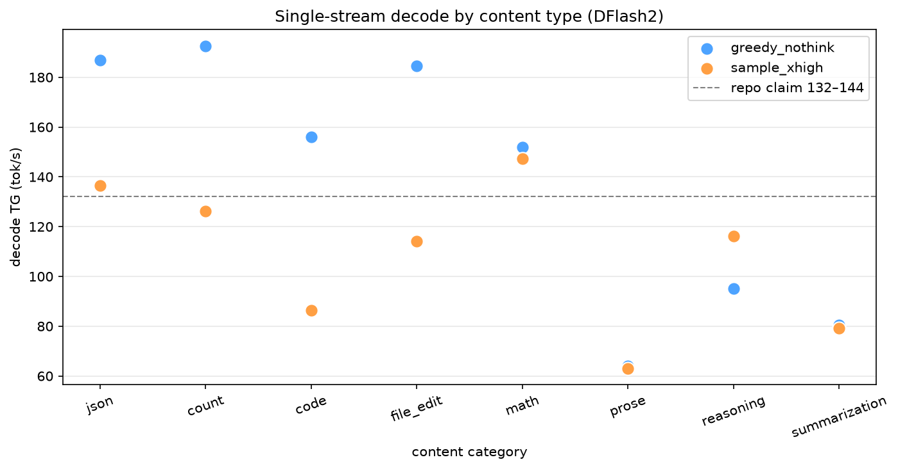
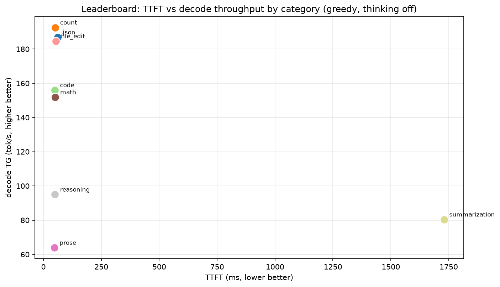
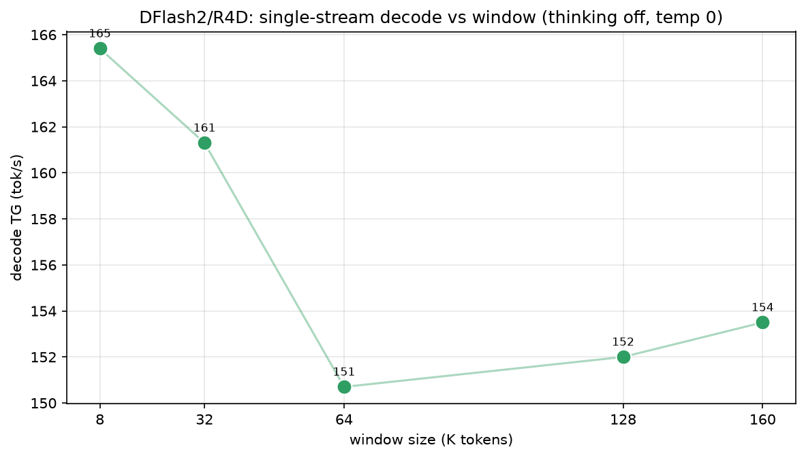
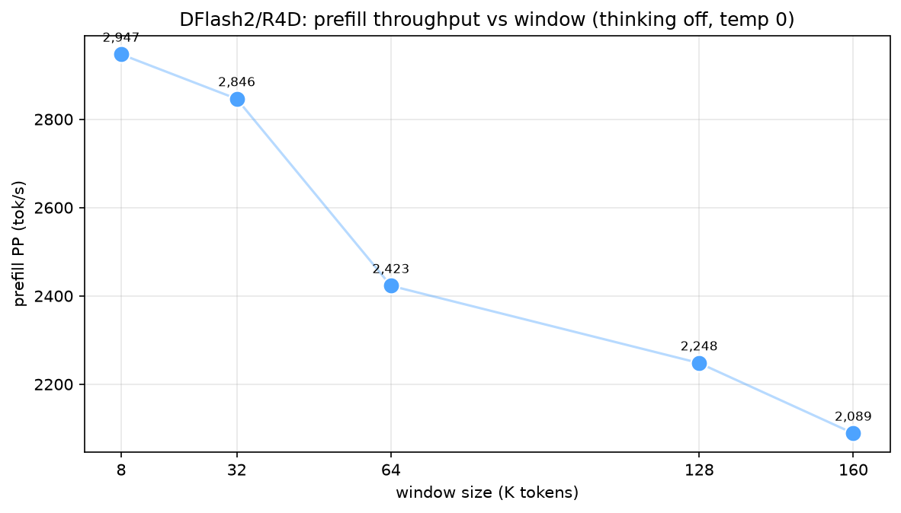
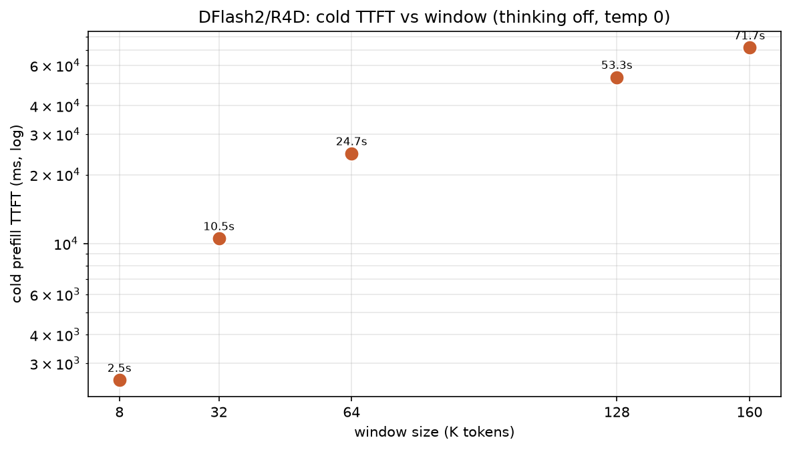

# DFlash2 / R4D — Qwen3.8-27B serving benchmark on dual R9700

**Date:** 2026-08-30  ·  **Stack:** `magiccodingman/vllm-radiance:1.0.11` (vLLM 0.28, ROCm 7.14, R4D attention)  ·  **Hardware:** 2× AMD Radeon AI PRO R9700 (gfx1201, 32 GiB each), Ryzen 9 9950X, CachyOS · **TP=2**, DFlash2 drafter (`z-lab/Qwen3.8-27B-DFlash2`, k=7, TRITON_ATTN), server default `thinking=xhigh`.

> **What this measures:** the *single-stream* character of the DFlash2 block-diffusion drafter + R4D kernels, and how prefill/decode scale with window size. Built to answer two questions: **how fast is decode really (it's not one number), and does it survive long context?**

## Headline findings

- **Decode is content-dependent, not a single number.** Structured/deterministic outputs (json, count, file_edit) decode at **185–193 t/s** (greedy, thinking off) and **114–137 t/s** (sampled, thinking xhigh); open-ended prose is **~64 t/s** regardless. The repo's **132–144 t/s** claim is the *deadline for drafter-favourable output*, and it is validated — greedy actually exceeds it.
- **Decode holds at long context.** At 128K and 160K resident, TG is **~152–154 t/s** — the DFlash2 drafter keeps high acceptance even far from the window's edge, unlike MTP-style speculation which degrades sharply at long context.
- **Prefill scales down with context** (chunked prefill + P2P all-reduce): PP falls from **~2.9 k t/s at 8K to ~2.1 k t/s at 160K**. Cold TTFT rises from 2.5 s (8K) to ~72 s (160K).
- **256K substitution:** the deployed server runs `max-model-len=163840` (confirmed via `/v1/models`), so the largest window tested is **160K**. 256K is outside this config's reach (it needs more KV cache than the 2×32 GiB budget leaves after weights + drafter at `gpu-mem-util 0.97`).

## Single-stream decode by content type

| category | TTFT (ms) | decode t/s (greedy, think off) | decode t/s (sampled, xhigh) |
|---|---|---:|---:|
| json | 62 | **186.9** | 136.6 |
| count | 50 | **192.6** | 126.1 |
| code | 49 | **156.0** | 86.4 |
| file_edit | 53 | **184.6** | 114.1 |
| math | 50 | **151.9** | 147.4 |
| prose | 47 | **63.9** | 63.0 |
| reasoning | 50 | **95.0** | 116.1 |
| summarization | 1730 | **80.4** | 79.1 |

**Reading it:** thinking OFF + greedy reveals the drafter's ceiling (how fast it *can* go); thinking xhigh + temp 1.0 is what the endpoint serves by default (production). If your workload is structured (JSON, code, edits, counting) you get 114–193 t/s; if it's open-ended prose/reasoning you get ~64–116 (the thinking trace dominates).

## Prefill & decode vs window size (thinking off, temp 0)

| window | PP (t/s) | cold TTFT | decode TG (t/s) | gen tokens |
|---|---:|---:|---:|---:|
| 8K | 2,947 | 2.5s | 165.4 | 256 |
| 32K | 2,846 | 10.5s | 161.3 | 256 |
| 64K | 2,423 | 24.7s | 150.7 | 256 |
| 128K | 2,248 | 53.3s | 152.0 | 256 |
| 160K | 2,089 | 71.7s | 153.5 | 256 |

**Note (256K substitution):** the server's `max-model-len` is **163840**; 160K is the largest measurable window and substitutes for the 256K intent. Decode TG is essentially flat (~150–165 t/s) from 8K to 160K, which is the notable result — the DFlash2 drafter is robust to long-context decode.

## Methodology

- Single-stream, concurrency 1, chat completions, streaming, tokens from server `usage` (never SSE chunks). `TG = 1/mean TPOT`; `PP = prompt tokens / cold TTFT`.
- **Content sweep:** 8 categories × 2 modes (greedy+t0+thinking off; sampled t1.0 p0.97+thinking xhigh), 256 gen, 2 runs each (median).
- **Window sweep:** unique per-window doc + one warmup request so prefix caching never contaminates cold prefill; prefill (W−64→1) then resident decode (→256).
- The server was warmed and idle; no concurrency during single-stream tests.

## Raw data

- `data/content_sweep.json` · `data/window_sweep.json` · figures in `report/figs/`. Re-run: `../<benchvenv>/python content_sweep.py` and `window_sweep.py`, then `make_plots.py` + this file.

## Attribution

- Stack: [magiccodingman/vllm-radiance](https://github.com/magiccodingman/vllm-radiance) (vLLM 0.28 fork of [StillDeadcode/vllm-radiance](https://codeberg.org/StillDeadcode/vllm-radiance)); models: `Qwen/Qwen3.8-27B-FP8` + `z-lab/Qwen3.8-27B-DFlash2` drafter (Apache-2.0). Setup guide: [dual-r9700-vllm-proxmox](https://github.com/bkvargyas/dual-r9700-vllm-proxmox) (P2P via emulated switch + XanMod kernel + NDEBUG RCCL).
- **AI-use disclosure:** the configs and measurements are the author's; AI assistance was used to write the runners and this report. All numbers come from recorded runs in `data/`.