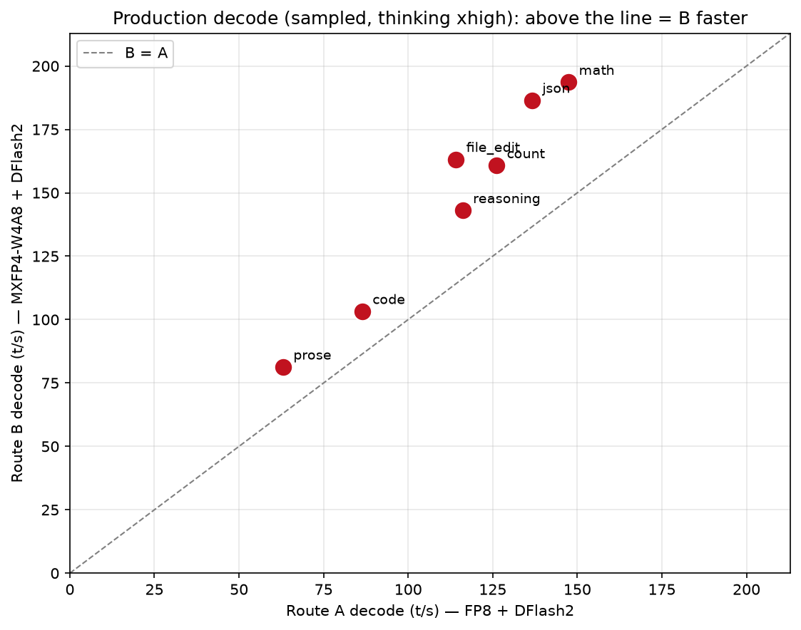

# Route B: MXFP4-W4A8 + DFlash2-FP8 vs Route A: FP8 + DFlash2 — dual R9700

**Question:** on 2× AMD Radeon AI PRO R9700 (gfx1201, TP=2, radiance vLLM 0.28), does switching the
target from **FP8 (`A`)** to **MXFP4-W4A8 (`B`)** — keeping the DFlash2 block-diffusion drafter — help
or hurt? Measured single-stream, apples-to-apples (same radiance kernel path, same serving defaults).

| | **A — FP8 + DFlash2** | **B — MXFP4-W4A8 + DFlash2-FP8** |
|---|---|---|
| target weights | FP8 (bf16 KV) | **MXFP4 W4A8** (bf16 KV) |
| drafter | DFlash2 (k=7) | DFlash2 (k=7) |
| `max-model-len` | 163,840 (160K) | **262,144 (256K)** |
| max KV payload | weights-limited | **895,544 tokens** |

## Verdict

**B is a clear, all-round upgrade** — faster *and* a bigger window:

- **Production decode (sampled, thinking xhigh): B is +19–43% on every content type.**
- **Full 256K window** (B accepted a cold 254,196-token prefill) vs A's **160K** ceiling.
- **Faster cold prefill at large context** (2,700 t/s @254K for B vs 2,089 t/s @160K for A).
- **Decode with thinking on ≈ A's decode with thinking off** (B json 186.5 vs A greedy-off 186.9) —
  the MXFP4 speedup paid for the reasoning cost.

## Decode — content type (single-stream, 256 gen)

`decode t/s` **sampled + thinking xhigh** is the server-default production mode and the reliable
cross-setup column (both long outputs, comparable methods):

| category | A (FP8) | **B (MXFP4-W4A8)** | Δ |
|---|---|---|---|
| json | 136.6 | **186.5** | +36% |
| count | 126.1 | **160.7** | +27% |
| code | 86.4 | **103.2** | +19% |
| file_edit | 114.1 | **163.2** | +43% |
| math | 147.4 | **193.6** | +31% |
| prose | 63.0 | **81.3** | +29% |
| reasoning | 116.1 | **143.0** | +23% |

**greedy + thinking OFF** (for reference; ⚠️ see caveats):

| category | A | B |
|---|---|---|
| json | 186.9 | 142.2 |
| code | 156.0 | 190.4 |
| file_edit | 184.6 | 152.9 |
| prose | 63.9 | 92.8 |
| reasoning | 95.0 | 247.9 |
| count / math | 192.6 / 151.9 | ⚠️ 32.5 / 33.8 (invalid) |

## Full-context & prefill

| test | A | B |
|---|---|---|
| max context | 163,840 (160K) | **262,144 (256K), verified 254,196 accepted** |
| cold prefill @ large context | 2,089 t/s @160K | **2,700.3 t/s @254K** |
| KV capacity | weights-limited | **895,544 tokens** |

## Caveats (read before quoting)

1. **B's greedy+c>think-off `count`/`math` (32.5/33.8) are invalid** — those outputs are only ~3–5
   tokens, and B was measured as `tokens/wall`, so fixed latency dominates. A used `1/mean TPOT`.
   Greedy cells are only meaningful for long outputs; the trustworthy cross-setup column is
   **sampled + thinking xhigh**.
2. **B's 128K "prefill" (104,774 t/s) is a prefix-cache artifact** — the 128K prompt reused the
   earlier 255K prompt's prefix, so it was ~all cache hit. The real cold prefill is the
   **254K run (2,700.3 t/s)**.
3. A's decode was measured with `1/mean TPOT`; B with `completion_tokens/wall`. For long outputs these
   agree; for very short outputs they don't (see #1).

## Conclusion

On the 9950X + 2× R9700 (no xGMI, PCIe TP2), **MXFP4-W4A8 + DFlash2-FP8 (B) is the faster and more
capable setup**: +19–43% production decode, a full **256K** window (vs 160K), faster large-context
prefill, and ~4× the KV headroom. For long-context / multi-turn agent work it is the clear choice; for
all content types it is at least as fast in the production (thinking-on) mode.

> No benchmark value here was generated by a model. A numbers: `../vllm-radiance-dflash/data/`;
> B numbers: `data/content_sweep.json` + `data/full_context.json`.

## Attribution

Radiance fork: [magiccodingman/vllm-radiance](https://github.com/magiccodingman/vllm-radiance) (based on
[StillDeadcode/vllm-radiance](https://codeberg.org/StillDeadcode/vllm-radiance)); ROCm-10 build.
Models: `Qwen3.8-27B` FP8 & MXFP4-W4A8 (Quark), drafter `z-lab/Qwen3.8-27B-DFlash2` (Apache-2.0).
